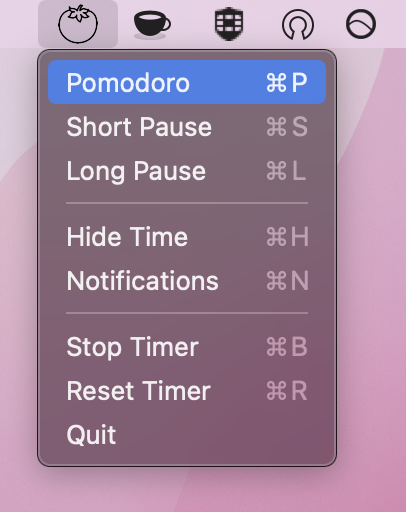
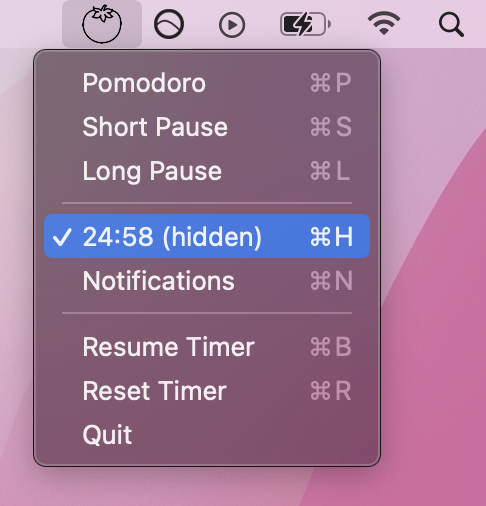

# A simple pomodoro-timer that lives in your menubar.

Pelidoro is a lightweight timer with a minimal, intuitive user interface.

You can start, stop or reset Pelidoro right from your menubar.

If you find yourself constantly watching the time, Pelidoro also lets you discretely track time in the background.

## What is the pomodoro technique?
The pomodoro technique is a time management method based on 25-minute stretches of focused work broken by 5 
minute breaks and 15 minute breaks following the completion of four work periods. 

## Features

- [x] Display timer in menu bar
- [x] Start and stop timer from menu bar
- [x] Option to hide time in menu bar
- [x] Notifies you to take breaks
- [ ] Create custom intervals
- [ ] Save user settings locally

## Installation
## Download prebuilt application
The simplest way to install pelidoro is to download the application prebuilt from the official [website]

[website]: https://app.paulpelikan.de
## Alternatively you can build the app by yourself:
### Prerequisites

[Rumps] is used to create the interactive menubar-icon. [py2app] is used to create a standalone OS X application.

    pip install rumps py2app

[Rumps]: https://github.com/jaredks/rumps
[py2app]: https://github.com/ronaldoussoren/py2app

### Create application

You can create a standalone OS X application with py2app:

    python3 setup.py py2app

After this an application will be available under `dist/`

